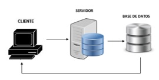

# Textiles Jiménez

## Descripción

 Programa desarrollado para el control de la contabilidad de la empresa Textiles Jiménez, con el fin de controlar las áreas económicas y tener la información correcta sobre los ingresos y egresos. Es importante conocer los valores de cada una de las áreas para realizar mayor o menor inversión conforme se vayan realizando las entregas.
 Otro punto importante es controlar las fechas de entregas para evitar retrasos y se generen pérdidas por las penalizaciones que ejecutan las empresas.

## Problema identificado

 La empresa no cuenta con un control sobre la producción, hablando exclusivamente de entregas y también de las prendas que el diseño conlleva bordado o estampado, además se desconocen los gastos que se generan en todos los departamentos, por ejemplo:

- Materia prima

- Pago a trabajadores

El problema principal es realizar el cálculo cuando se termina la temporada se tiene que realizar la cuenta y no se tienen los valores correctos para que la empresa conozca cuánto fue el total de su inversión en materia prima, la cantidad exacta en el pago a los trabajadores y también el total de la ganancia para la empresa.

Este problema se ha tenido desde hace muchos años y cada temporada representa un problema para la empresa porque la inversión muchas ocasiones es mayor que la ganancia.

## Solución

Con este sistema se pretende ayudar a tener un mejor control sobre dichas áreas y obtener mayores ganancias para la empresa, debido a que este sistema permitirá controlar la inversión en material prima, pago a trabajadores y otros gastos generados por la empresa.
También ayudará a conocer con exactitud las fechas de entrega de los pedidos y las fechas de envío para los pedidos que el diseño conlleve un bordado o estampado, con este control se pretende evitar retrasos en la entrega a las tiendas departamentales.
Otro punto importante, es el control de los pagos a trabajadores, de esta manera se conocerá la cantidad exacta que ganan porque se controlará por los nombres de cada uno.
La materia prima también es importante conocer el total que se invierte porque el precio por kilo no se mantiene toda la temporada, cada cierto tiempo se incrementa el precio por varias razones, dado que si no se conoce este dato con certeza se pueden tener pérdidas al final de la temporada.

## Arquitectura

## Tabla de contenidos
- [Requerimientos](#requerimientos)
- [Servidores de aplicación y base de datos](#servidores-de-aplicación-y-base-de-datos)
- [Paquetes adicionales](#Paquetes-adicionales)
- [Configuración](#configuración)
- [Uso](#uso)

<!-- toc -->

## Requerimientos

### Servidores de aplicacion, base de datos

- Servidor de aplicación. MAMP versión 4
- Base de datos. MySQL con PHP

### Paquetes adicionales

Ninguno

### Versión de Java
- Java. 8
- JDK. 1.8
- NetBeans. 8.2

## Instalación

### Instalación del ambiente de desarollo

El ejecutable se creará en el programa Launch4j para que sea extensión .exe, además de crear el archivo .jar

Utilizando este programa, el ejecutable se podrá correr en la computadora seleccionada e incluso volver a instalar si se llega a desinstalar por alguna circunstancia externa al administrador.

_Instrucciones:_
- Ejecutable MAMP en el escritorio, dar doble clic y posteriormente dar clic en “Iniciar Servidores”.
- El usuario dará doble clic sobre el ejecutable TextilesJimenez.jar; que se encontrará ubicado en el escritorio del equipo.
- La aplicación se abrirá y el usuario podrá comenzar a utilizarla.

### Ejecución de pruebas manualmente

Las pruebas se realizan de una manera sencilla, si se abre la página principal de phpMyAdmin y no se tiene respuesta es porque no se ha iniciado el servidor MySQL Server.

Otra prueba es al ingresar información en las tablas y que no se guarde el registro en la base de datos.

Las pruebas no pueden ser muy variadas para este sistema porque su funcionamiento es básico y solo interviene el sistema con la base de datos.

## Configuración

### Configuración del producto
El sistema TextilesJimenez solo requiere la configuración de la base de datos, la instalación del servidor en este caso MAMP para que pueda realizar la conexión y los cambios efectuados se guarden de forma correcta.

La aplicación TextilesJimenez ya está configurada para funcionar sin la necesidad de alguna configuración adicional.

### Configuración de los requerimientos
- Instalación de MAMP.
- Corroborar que el puerto de Apache sea 80.
- Corroborar que el puerto de MySQL sea 3306.

## Uso

### Manual para usuario final

El usuario ingresará a la aplicación ubicada en el escritorio de la computadora principal.
La primera pantalla que visualizará será el menú principal con las opciones:

- Pedidos
- Pagos
- Materia prima
- Préstamos
- Cuenta

#### Pedidos

En la opción Pedidos se tendrá el botón Modificar, al dar clic en el botón el usuario ingresará a la pantalla principal Pedidos y Bordado.

La pantalla controlará las modificaciones de las fechas de entrega para Pedidos y Bordado; en la sección de Pedidos se tendrá un TextField donde el usuario ingresará el modelo del suéter a buscar, a continuación, dará clic en el botón “Buscar”, en la tabla se mostrarán los resultados a partir de la búsqueda realizada en la base de datos; el usuario seleccionará la fila en la columna Fecha del modelo deseado.

En la parte inferior de la pantalla se encuentra otro TextField donde el usuario ingresará el nuevo estatus del modelo seleccionado, teniendo como opciones:

 •	Modificar la fecha de entrega
 • Cambiar el estatus a Entregado

En la sección de Bordados se tendrá un TextField donde el usuario ingresará el modelo del suéter a buscar, a continuación, dará clic en el botón “Buscar”, en la tabla se mostrarán los resultados a partir de la búsqueda realizada en la base de datos; el usuario seleccionará la fila en la columna Fecha del modelo deseado.

De la misma manera que en Pedidos, el usuario ingresará el nuevo estatus del modelo seleccionado, teniendo como opciones:

  • Modificar la fecha de entrega
  • Cambiar el estatus a Entregado
